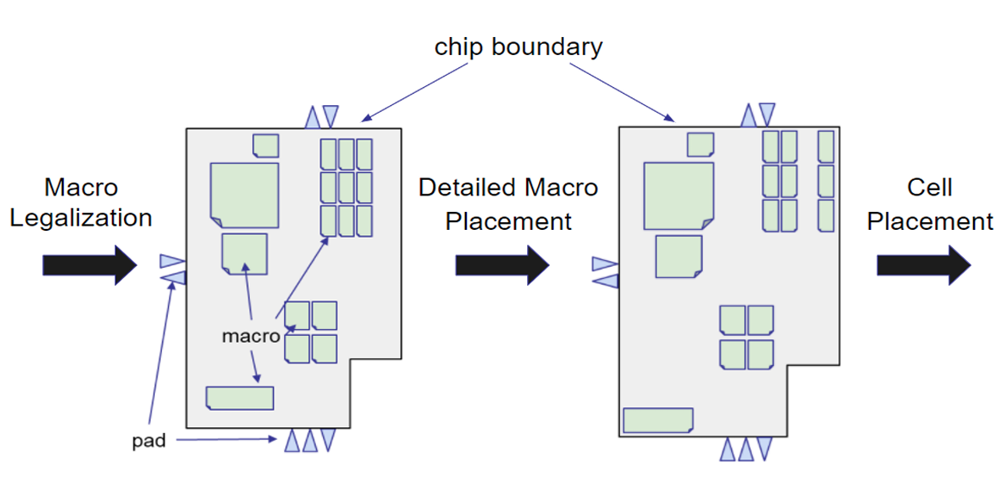
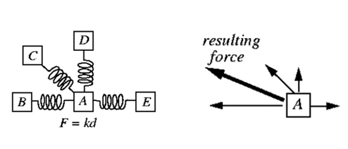

# Wirelength Driven Detailed Macro Placement with Force-Directed Method

---

Created: November 3, 2023 11:57 PM
Last Edited Time: November 4, 2023 12:05 AM

# Usage

---

Build: GCC/G++

Usage:
``./main caseOO.v caseOO.lef caseOO.def caseOO.mlist caseOO.txt caseOO.dmp``

# Introduction

---

This is the problem from the 2022 ICCAD Contest

http://iccad-contest.org/tw/Problems/CADContest_2022_Problem_D_20220826.pdf

http://iccad-contest.org/tw/03_problems.html

In order to reduce the design cycles and the time consumption of designing, the IP (Intellectual Property) modules and embedded memory (as known as macros) had been popularly used in IC designs. These kinds of designs had been named as **“Mixed-size Circuit Design”** because they have included macros and standard cells within a chip. As the mixed-size circuit design nowadays often include thousands of macros and millions of standard cells. The industries need the modern placing tools to fulfill the demands of design. The most general design method of mixed-size placement includes three phases:

- Mixed-size prototyping
- Macro placement
- Standard-cell placement

The detailed steps in the second phase **“Macro placement”** includes:

According to the initial placement and based on the specific measure method, such as **wirelength**, **routability**, **macro displacement** and the **free spaces** left for the placement of the standard-cell, we utilize them to determine the macro's legal placement and their orientations. The legal placement of the macros not only includes that the macros should be placed within the boundary of placement area and not overlapping with each other’s, but also to reserve a given spacing between each other’s.

This phase can furtherly divide as subproblems of **“Macro Legalization”** and **“Detailed Macro Placement”**. This research project will be mainly dealing with the detailed macro placement.

# Problem Description

---

Given a netlist and its layout, including a place-able area and legal placement of the macros. We have to find out the best placement and orientation of the moveable macros by flipping and slightly adjusting their placement according to the given optimization goals and placement constraints.
Three types of files will be given:
First type of files includes a complete netlist and its layout. Including a Verilog format(.v), LEF(.lef) file, and a DEF(.def) file. Second type of file includes one file descripts a preset of legal macro placement with the DEF format(.mlist). The third type of file includes an ASCII format of file descripts three given constraints:
i. maximum_displacement_constraint
ii. minimum_channel_spacing_between_macros_constraint
iii. macro_halo

# Research Method

---

We Separate the method into 3 phases:

**i. File Processing**

The first step of our program is to combine different information of the cells/macros which were given in the different input files (LEF, DEF, .Mlist). The LEF (Library Exchange File) file contains the physical information of all of the types of the macros/cells. We have to store the information contain in it at the beginning so that when we are collecting individual cells/macros’ information from the DEF file or and the .mlist file, we can get the corresponding cell/macro type’s information given by the LEF file.

In order to reduce time for searching, we decide to use <unordered_map> in C++11 STL library to contain the information of the macros and cells. The time complexity of the find() function of <unordered_map> is O(1) because of the <unordered_map> is implemented by hash table. By using this data structure, we reduce the time of reading input files theoretically comparing to using the <map> of C++ STL library.

**ii. Displacement**

After we collected all of the information including the macros/cells and the netlist stored in the Verilog file, we can start to optimize the placement of the macros. We choose to use the force directed method in order to reduce the total wirelength.

By this method, we regard every connected wire of a macro as forces, and by combining them together we can get a resulting force. (See figure b and c.) If we move the target macro following the resulting force, we can get the wirelength reduction.

**iii. Flipping**

We choose to implement the flipping algorithm by exhaustive search method due to the actual run time is pretty little. By this method we flip a target macro in every direction to find out the shortest wirelength. For each macro:

.png)

Then we flip the macro in four orientations to find out the shortest wirelength of each macro. And we do the same method to all the macros to find out the minimum global wirelength.
Here's the result of the left percentage of the wirelength after the functions:

|  | After Displace |
| --- | --- |
| Case 1 | 99.6685% |
| Case 2 | 99.4496% |
| Case 3 | 99.8393% |
| Average | 99.6524% |

|  | After Flipping |
| --- | --- |
| Case 1 | 98.9456% |
| Case 2 | 99.4473% |
| Case 3 | 98.6952% |
| Average | 99.0293% |

# Results and Discussion

---

|  | Original | Displace and Flip | Flip Only |
| --- | --- | --- | --- |
| Case 1 | 223,512,126,333 | 223,598,689,971 | 221,687,578,038 |
| Case 2 | 287,587,421,039 | 287,837,750,235 | 290,875,098,664 |
| Case 3 | 348,489,115,844 | 337,218,076,705 | 337,284,726,753 |
| Case 4 | 430,704,746,568 | 425,836,277,848 | 425,836,277,848 |
| Case 5 | 300,122,250,720 | 425,836,277,848 | 294,718,297,480 |

We evaluate our program by NTUplace3. The results are determined by HPWL (Half-Perimeter Wirelength) (less is better). As you can see from the table above, the results of the displacement did not go well even though the wirelength has been reduced. The reason of this happens is because of the legal placement of the macros given from the .mlist file has a huge difference with the initial placement given by the DEF file (See figure d and e). And after the NTUplace3 do the cell placement, the cell might be moved by a large distance because of the overlapping between the macros and cells causing the increase of the total wirelength. Thus, we decided to do the flip only in our program to ensure the results are guaranteed to be better.

.png)